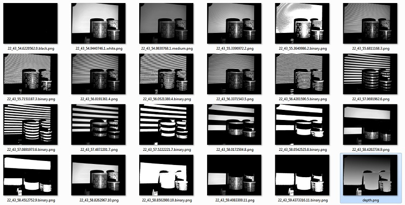
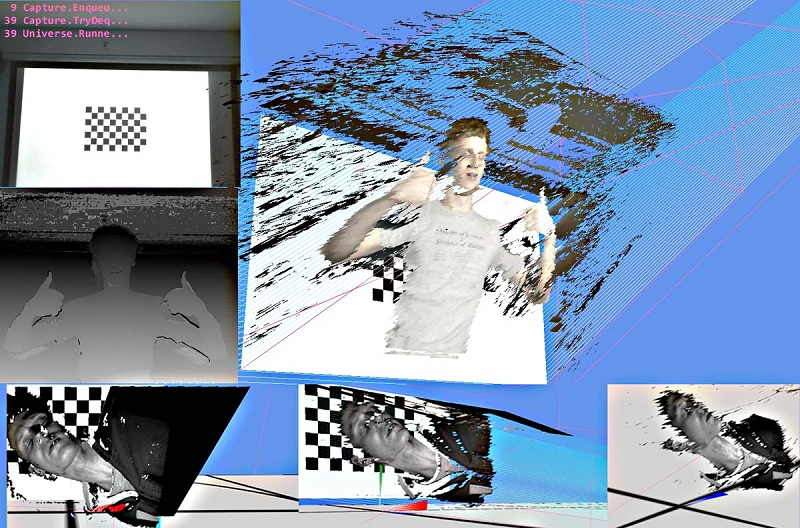
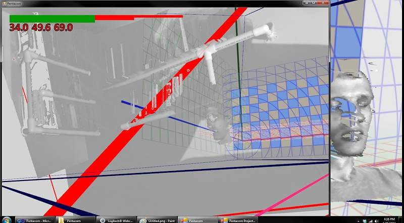
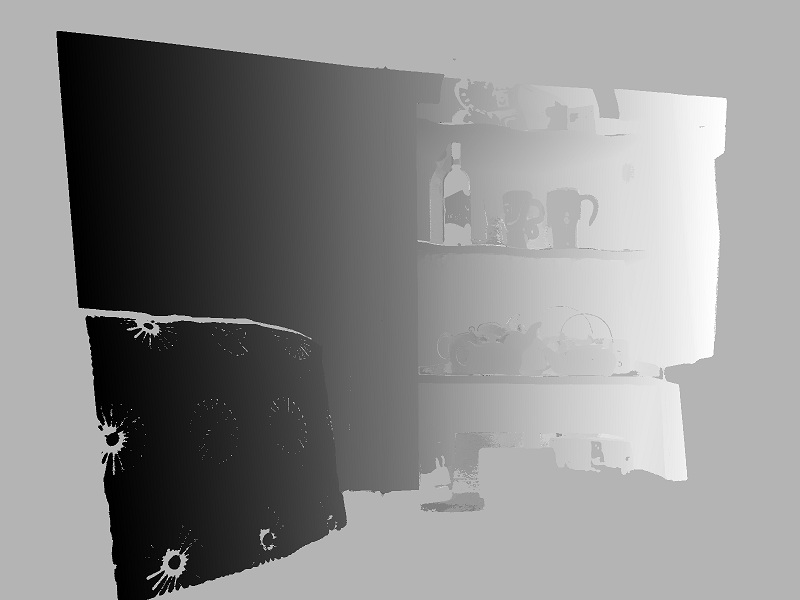

Nothing to see here, just some happy hobby hacking with Structured Light 3D scanning.

As far from industrial strength removed as can be. Ask me why...

Meanwhile, here's a few images I got at one point or another using this code.

